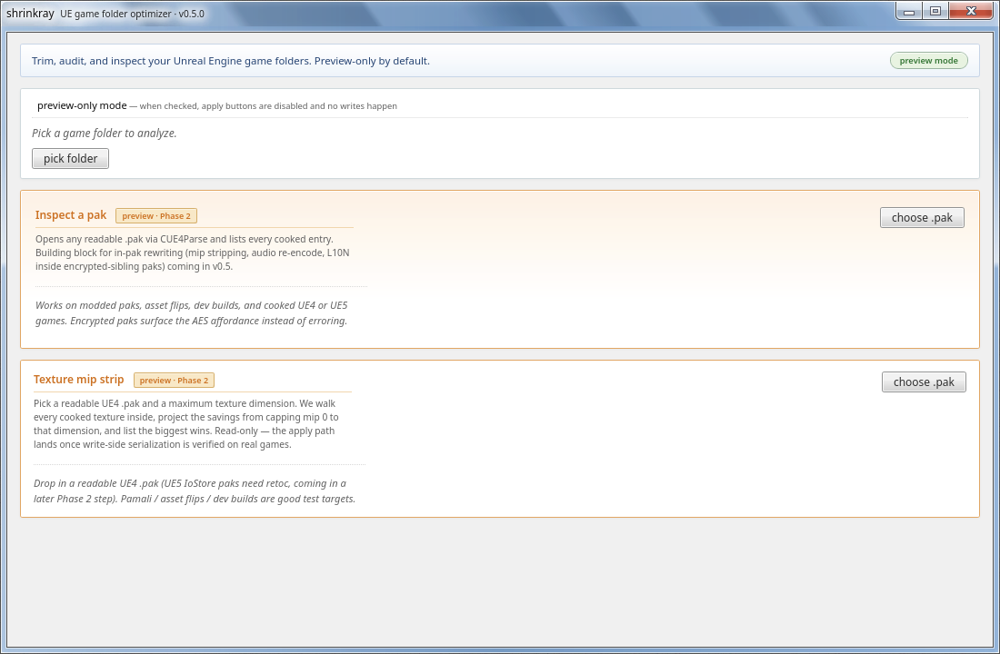
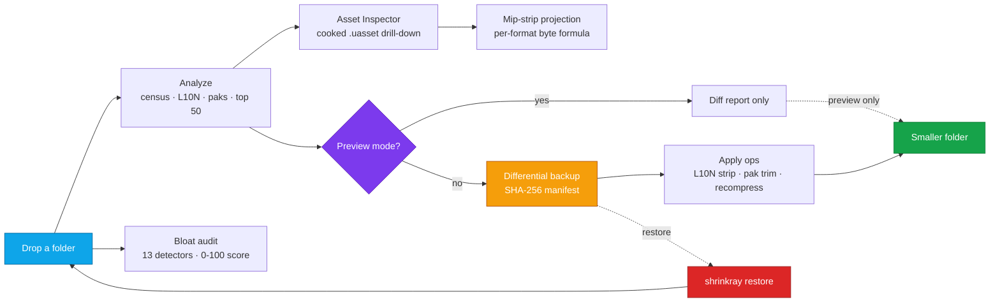

<div align="center">

# shrinkray

### Cut Unreal Engine game folder size by trimming what you don't need.

#### *Drop a folder. Get a smaller folder. Refuse to write without a backup.*

<br />

[](#stack)
[](#stack)
[](#validation-against-real-games)
[](CHANGELOG.md)
[](LICENSE)

<br />

<sub>analyze · audit · strip languages · trim paks · recompress loose files · backup & restore · cooked-asset inspection · mip-strip projection</sub>

</div>

<br />

> [!NOTE]
> **What this is.** An integrated *analyze → trim → smaller game* workflow for UE4/UE5 installs, with a backup-or-refuse policy from day one.
>
> **What it isn't.** A pak recompressor, a transcoder, or a magic wand for AAA UE5 IoStore titles. Honest scope below — see [What shrinkray will NOT do](#what-shrinkray-will-not-do-v1).

---

## At a glance

<table>
<tr>
<td width="50%">

### Best real-world result so far

**Pamali (UE4 demo, 591 MB install)**

```
185 textures identified
739 MB total texture data
570 MB reclaimable  (77 %)
   ↑ at a 1024 px mip-0 cap
```

Top wins are 4 K hair masks cooked at full res
that nobody zooms in on. Read-only projection
today; byte-exact write lands in v0.6.

</td>
<td width="50%">

### What ships in v0.5.0

- 13-detector **read-only bloat audit**
- Cooked **.uasset inspector** (mip table, export list, custom-version fingerprint)
- **Mip-strip projection** with per-format BC/ASTC byte formula
- L10N strip + pak trim + loose-file recompress
- Differential **backup + restore** with hash verification
- Win7 **Aero** UI, custom title bar, in-app file dialog
- **CLI**: `shrinkray audit <path>`

</td>
</tr>
</table>

---

## Screenshots

<div align="center">
  
  <br /><sub><b>Main window</b> — Aero chrome, preview-mode default-on, the three Phase 2 entry panels (pick folder · Inspect a pak · Texture mip strip)</sub>
</div>

<br />

> More panels (analyze report, bloat audit, asset inspector, mip-strip projection, in-app file dialog) land in [`docs/screenshots/`](docs/screenshots/README.md) as we capture them.

---

## Table of contents

- [Why](#why)
- [The pipeline](#the-pipeline)
- [Realistic targets](#realistic-targets)
- [What shrinkray will NOT do](#what-shrinkray-will-not-do-v1)
- [Safety model](#safety-model)
- [Roadmap](#roadmap)
- [Quick start](#quick-start)
- [What this build does](#what-this-build-does)
- [Stack](#stack)
- [Project layout](#project-layout)
- [Validation against real games](#validation-against-real-games)
- [License](#license)

---

## Why

UE games ship with predictable bloat — but **not the bloat most tools promise to fix.** A research pass (see [`research/SUMMARY.md`](research/SUMMARY.md)) found modern UE5 already ships near-optimal codecs (Oodle Kraken, Bink Audio, BCn textures) that a third-party tool cannot meaningfully beat. The real size wins come from **dropping content**, not transcoding it:

- **Unused languages** — a fully-voiced AAA ships 4–8 dub languages; you only play one. Often **30–60 % of the audio bucket** alone, zero quality loss.
- **Orphan pak entries** — dev/debug paks, duplicated shader caches, leftover platform variants.
- **Loose marketplace / modded assets** — uncooked `.png/.wav/.flac` re-encodable with no parser needed.
- **Asset-flip / RPG-Maker-on-UE bloat** — sometimes 80 % of the install is content that's never referenced.
- **Oversized mip 0 textures** — 4 K hair masks, 4 K decals, anything where the source artist forgot to set a max LOD.

Existing tooling (UnrealPak, umodel, FModel, UAssetGUI, `repak`) **reads** UE assets but doesn't apply optimizations. shrinkray is the integrated workflow on top.

---

## The pipeline



Every destructive op is preceded by a differential backup entry. Preview mode is default-on for first-time users — every "Apply" button is hard-disabled until you opt out.

---

## Realistic targets

| Game type | Typical savings | Where they come from |
|---|---|---|
| Asset-flip indie / RPG Maker UE ports | **50–80 %** | Loose-file recompression + orphan trimming |
| Heavily-modded titles | **30–60 %** | Uncompressed audio re-encode + language stripping |
| Mid-tier indie | **20–40 %** | Language stripping + dev/debug pak removal |
| UE4 game w/ readable paks (Pamali class) | **up to 77 %** of texture bytes | Mip-strip projection (v0.6 will apply it) |
| Already-optimized AAA UE5 (IoStore) | **5–15 %** | Language stripping (the bulk) + orphan trimming |

These are the upper-realistic numbers. The lower bound on a modern UE5 single-language AAA install is often **<5 %**. shrinkray surfaces the predicted delta in the diff report before any write.

---

## What shrinkray will NOT do (v1)

> [!IMPORTANT]
> Honesty about scope, because half the existing UE-tool ecosystem overpromises.

<details>
<summary><b>Click to expand — the deliberate "no" list</b></summary>

- **No pak recompression.** Oodle Kraken (the UE5 default) beats Zstd on both ratio and decode speed for game data. Free Oodle encoders don't legally exist. Transcoding to Zstd would actually inflate or stutter.
- **No cooked `.uasset/.uexp/.ubulk` surgery (write-side).** Correctly round-tripping cooked UE assets needs a serializer that tracks ~50 per-subsystem custom versions across every engine release. Only CUE4Parse (read) and UAssetAPI (read/write) do that today. Read-side ships in v0.5; write-side lands v0.6 via a bundled UAssetAPI sidecar.
- **No Vorbis re-encode by default.** Vorbis → Opus is realistically ~20–25 % per file with a lossy → lossy quality cost — opt-in only in v2.
- **No Bink Audio anything.** No free encoder, no Rust binding.
- **No BC3 → BC7 transcode.** Same 8 bpp, 0 % size win.
- **No IoStore `.utoc/.ucas` rewriting in v1.** Most UE5 AAA install bytes live in IoStore; v1 reports them but leaves them alone. v0.7 wires in `retoc`.

If the size you wanted came from those features, v1 is not for you yet.

</details>

---

## Safety model

> [!WARNING]
> **shrinkray refuses to write without a backup.**

On first run it offers:

- **Differential backup** *(default)* — records only the bytes about to be overwritten. Typically 5–15 % of the folder.
- **Full copy** — safe but expensive on a 100 GB AAA folder.
- **Abort.**

```bash
shrinkray restore <folder>   # replays the manifest in reverse with hash verification
```

Signed paks (`.sig` sibling present) and undecryptable AES paks are **skipped, never partially modified**. The restore button is wired into the diff report from day one.

---

## Roadmap

| Phase | What | State |
|---|---|---|
| 0 | Scaffold + folder census by extension, rough savings estimate |  |
| 1 | Scan & report + differential backup/restore + loose-file recompression + L10N stripping + pak trimming + dry-run + diff report UI |  |
| 1.5 | Read-only multi-detector bloat audit (13 detectors), Win7 Aero UI, in-app file dialog, custom title bar |  |
| 2 read-side | Cooked-asset inspection via bundled .NET sidecar (CUE4Parse master, vendored): mip-strip projection (byte-exact), per-package inspection |  |
| 2 write-side | Cooked `.uasset/.uexp/.ubulk` rewrite — texture mip strip apply, audio L10N replacement inside paks. Needs UAssetAPI bundle. |  |
| 2 IoStore | `retoc` integration for UE5 AAA `.utoc/.ucas` containers. AES key handling. |  |
| 3+ | Vorbis → Opus opt-in, SSIM validation, mesh LOD strip, orphan-asset cross-reference, screenshot-diff launch validation |  |

The original 6-phase roadmap was rewritten after the research pass — see [`research/SUMMARY.md`](research/SUMMARY.md) for the full reasoning.

---

## Quick start

```bash
# Clone WITH submodules (CUE4Parse lives under sidecar/external/CUE4Parse)
git clone --recurse-submodules https://github.com/Thanukamax/shrinkray
cd shrinkray

# If you already cloned without --recurse-submodules:
git submodule update --init

bun install
cd src-tauri && cargo fetch && cd ..

# Build the .NET sidecar (requires dotnet 8 SDK)
bash scripts/build-sidecar.sh

python3 scripts/generate_icons.py    # placeholder icons; one-time
bun run tauri dev                    # window at localhost:1420
bun run tauri build                  # production binary
```

<details>
<summary><b>System tool deps (Linux)</b></summary>

- **Required:** `dotnet-sdk-8.0`, `opus-tools` (for `opusenc`), `libz-ng.so.2`
  - Fedora / Nobara: ships by default
  - Debian / Ubuntu: `apt install libz-ng opus-tools`
- **Optional:** `oxipng` (via `cargo install oxipng` or your distro)
- **Recommended for sidecar native helpers:** `cmake` + a C/C++ toolchain. The native blob is optional — Linux builds work without it.

</details>

---

## What this build does

<table>
<tr>
<td valign="top" width="50%">

#### Analyze
Folder census + L10N detection + pak inventory (signed / encrypted / readable / IoStore stub) + top-50 fattest files. CEF locale `.pak` files correctly filtered out (so they don't inflate the "unreadable" count).

#### Bloat audit *(read-only)*
**13 detectors**, 0–100 bloat score, Markdown + JSON output. Works on **encrypted installs** where content surgery is impossible:

- *v0.4:* `patch_overlay`, `stale_version_dir`, `sharded_videos`, `large_chunk`, `encryption`, `editor_leftovers`, `launcher_satellite`
- *v0.5:* `shader_rhi_redundancy`, `redist_installer`, `platform_siblings`, `mod_manager_artifacts`, `duplicate_content` (SHA-256), `cef_locales`

#### Asset Inspector *(v0.5)*
Drill into a single cooked `.uasset` via the .NET sidecar: full export list, class names, custom-version fingerprint, mip table per texture (per-mip dimensions + byte sizes). Pagination, search, payload/package filters.

</td>
<td valign="top" width="50%">

#### Mip-strip projection *(v0.5)*
Walk every UTexture-derived export in a readable pak, project savings from capping mip 0 dimension. Per-format BC/ASTC byte formula. **Pamali UE4 demo: 185 textures → 570 MB save at 1024 px cap (77 %).** Read-only; write-side lands v0.6 via UAssetAPI.

#### L10N strip + pak trim
Drop dub languages from loose files **and** from inside paks (preserves version / mount / path-hash-seed via `repak::into_pakwriter`). Empty-after-trim paks deleted; signed + encrypted paks skipped.

#### Loose-file recompression
PNG via `oxipng`, WAV / FLAC → Opus via `opusenc`. Both detected at runtime; missing tools surface install hints in the UI.

#### Differential backup + restore
Every destructive op is preceded by a `shrinkray_backup/` entry. Restore replays the manifest in reverse with hash verification.

#### Preview mode
Default-on for first-time users; hard-disables every apply button. Toggle is localStorage-backed.

#### Win7 Aero UI *(v0.5)*
Custom title bar (Tauri OS decorations off), `7.css` window chrome, frosted-glass title bar, in-app Win7-style file dialog, procedurally-generated Aero wallpaper.

#### CLI
```bash
shrinkray audit <path> [--json] [--out FILE]
```
Run from a terminal, share the markdown, paste it into a bug report.

</td>
</tr>
</table>

---

## Stack

- **Tauri v2** + **Bun** + **Vite** + **React 19** + **TypeScript** *(mirrors the [vn2apk](https://github.com/Thanukamax/vn2apk) + [wgpu-shader-explorer](https://github.com/Thanukamax/wgpu-shader-explorer) pattern)*
- **Rust core:** `walkdir`, `tauri-plugin-dialog`, `repak` 0.2.3, `sha2`, `dirs`. Plus `image_dds`, `intel_tex_2`, `symphonia`, `opus`, `image-compare`, `rayon`.
- **Phase 2 sidecar:** .NET 8 self-contained CLI vendoring **CUE4Parse master** (Apache 2.0) as a Git submodule at `sidecar/external/CUE4Parse/`. JSON-over-stdin IPC. ~75 MB published binary. Three additive patches to CUE4Parse handle UE4.13-era cook layouts — see [`CHANGELOG.md`](CHANGELOG.md) v0.5.0.
- **Frontend:** `7.css` for native Win7 Aero chrome (`.window`, `.title-bar`, fieldset / button styling).
- **Shell-out binaries:** `oxipng`. Optional: `mozjpeg`, `cwebp`.
- **Not used (yet):** FFmpeg, `unreal_asset` crate, Bink anything. UAssetAPI bundle pending v0.6 write-side.

---

## Project layout

<details>
<summary><b>Click to expand the tree</b></summary>

```text
src/                                # React frontend
  App.tsx                           #   top-level shell + sections
  TitleBar.tsx                      #   custom Aero title bar           (v0.5)
  OpenDialog.tsx                    #   in-app Win7 Open dialog         (v0.5)
  AssetInspector.tsx                #   cooked .uasset drill-down       (v0.5)
  MipStripPanel.tsx                 #   texture mip-strip projection    (v0.5)
  assets/wallpaper.jpg              #   procedurally-generated Aero bg  (v0.5)

crates/
  shrinkray-core/src/               # destructive-write subsystems
    analyze.rs                      #   folder census + L10N + CEF filter
    pak.rs                          #   repak wrapper + pak classification
    backup.rs                       #   differential backup + restore
    strip.rs                        #   L10N stripping + pak trimming
    recompress.rs                   #   PNG / WAV / FLAC recompression
  shrinkray-audit/src/              # read-only bloat audit
    detectors/                      #   one .rs per detector, 13 total
  shrinkray-sidecar/src/            # Rust IPC client + types
  shrinkray-cli/src/                # CLI binary

sidecar/
  ShrinkraySidecar/                 # .NET 8 sidecar (CUE4Parse host)
    AssetInspector.cs               #   per-package inspection + mip table
    AssetLister.cs                  #   pak entry enumeration
    StripMipsPlanner.cs             #   walk + project mip-strip savings (v0.5)
    Program.cs                      #   JSON-over-stdin dispatcher
  external/CUE4Parse/               # Git submodule — master + 3 patches

src-tauri/src/
  lib.rs                            # tauri::commands wiring

research/                           # research notes A-E + SUMMARY (read first)
scripts/                            # generate_icons.py, build-sidecar.sh, lyra-smoke.sh
docs/screenshots/                   # README screenshots
.github/workflows/                  # CI (cargo test + clippy + bun build)
```

</details>

---

## Validation against real games

Unit tests build synthetic paks via `repak`'s writer and round-trip them through the trim + backup + restore pipeline — **157 tests, all in CI**. That gates correctness of the *plumbing*, not that shrinkray-modified games still launch.

The one corpus test that would prove launch-safety — Lyra Starter Game cooked PC build, optimize, boot, watch for crash — needs an Epic account to download Lyra source and a full Unreal Engine install to cook a binary, neither of which fits free GitHub runners. Until a self-hosted runner with a pre-cooked corpus exists, **Lyra validation is a manual pre-release step**: see [`scripts/lyra-smoke.sh`](scripts/lyra-smoke.sh).

<table>
<tr>
<th>Game</th><th>Engine</th><th>Use as</th><th>State</th>
</tr>
<tr>
<td>Pamali demo</td><td>UE4 (4.13-era)</td><td>readable-pak target — primary mip-strip subject</td><td>185 textures, 570 MB save at 1024 px</td>
</tr>
<tr>
<td>Stellar Blade</td><td>UE5</td><td>IoStore corner case (60 GB AAA)</td><td>Detected: 64 paks all IoStore, retoc Phase 2 needed</td>
</tr>
<tr>
<td>AUGUST NIGHT</td><td>UE5</td><td>IoStore at small scale (1 pak)</td><td>Reproduces the IoStore branch</td>
</tr>
<tr>
<td>Wuthering Waves</td><td>UE5</td><td>fully-encrypted target</td><td>Audit-only; content surgery blocked</td>
</tr>
<tr>
<td>Lyra Starter Game</td><td>UE5</td><td>launch-validation target</td><td>Manual pre-release; not in CI</td>
</tr>
</table>

---

## License

**Source-available, no redistribution** — see [LICENSE](LICENSE).

You may clone this repo, read the source, and build shrinkray for your own use. You may **not** redistribute the source or binaries, mirror the repo, or publish forks / modified versions without prior written permission.

Earlier commits (v0.3.x and prior) were MIT-licensed and remain so for anyone who obtained them under that license; this restriction applies to commits from the relicense onward. The copyright holder reserves the right to relicense future versions under permissive terms at any time.

<br />

<div align="center">

<sub>Built with Tauri v2, Rust, React 19, .NET 8, and an unreasonable amount of patience for cooked UE4 textures.</sub>

</div>
