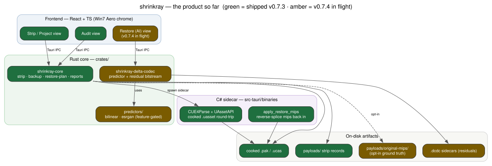
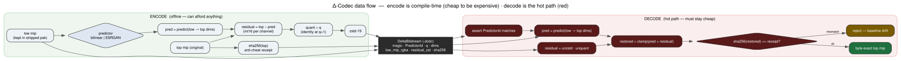
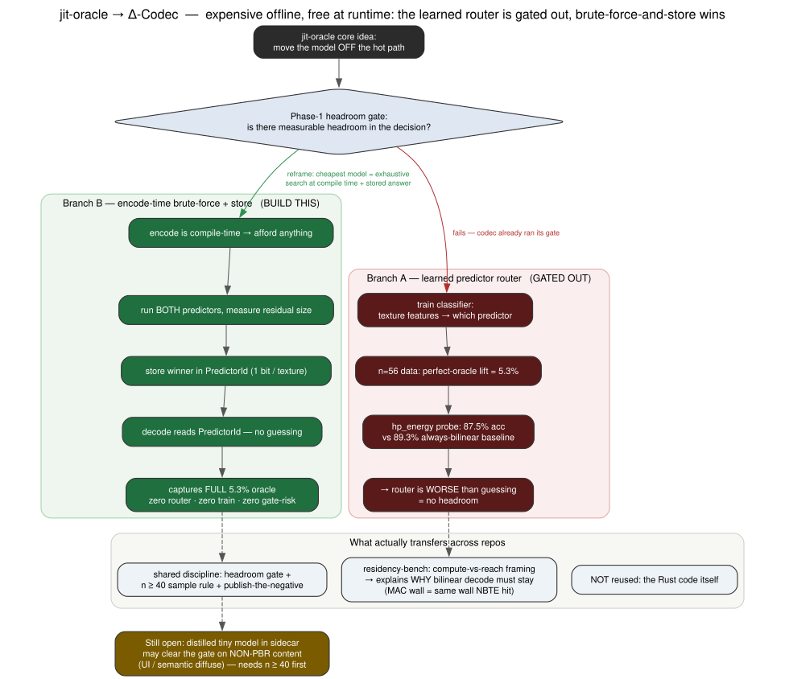

# shrinkray — architecture & concept diagrams

Rendered flow diagrams (Graphviz). Editable sources live in
[`docs/diagrams/*.dot`](diagrams/); SVG is canonical, PNG for quick preview.
Re-render with:

```bash
cd docs/diagrams
for f in *.dot; do dot -Tsvg "$f" -o "${f%.dot}.svg"; dot -Tpng -Gdpi=140 "$f" -o "${f%.dot}.png"; done
```

Authored 2026-06-06.

---

## 1 — The product so far

What shrinkray is end-to-end: Tauri v2 desktop tool over cooked Unreal Engine
content — byte-exact savings projection, structural audit, and the Δ-Codec
research artifact. Thin Rust core + C# sidecar around CUE4Parse / repak.



Green = shipped in v0.7.3 (`ca96e5d`); amber = v0.7.4 in flight on
`feat/v0.7.4-restore-loop`. 197 workspace tests, 1 ignored (repak/CUE4Parse
round-trip gap).

---

## 2 — Δ-Codec data flow

One bitstream carries **a cheap prediction of the top mip** + **a lossless
residual**. Restore re-runs the predictor and adds the residual → byte-exact in
RGBA at `q=1`, verified by a SHA-256 receipt.



**Key asymmetry (red = the hot path):** ENCODE runs once, offline, and can afford
anything. DECODE runs at install/restore time and is where cost hurts. ESRGAN
decode ≈ 6 min / 56 textures (compute-bound); bilinear decode is cheap
(bandwidth-bound). This asymmetry is the hinge for diagram 3.

---

## 3 — The jit-oracle → codec mapping

The warmcore `jit-oracle` pattern = **"expensive offline, free at runtime —
distill the decision off the hot path."** Mapped onto the codec it splits into a
dead branch and a live branch.



### One-line takeaways
- **Branch A (learned router) is a no-build** — the codec's own n=56 data already
  failed jit-oracle's Phase-1 headroom gate (5.3% ceiling; probe worse than the
  constant function).
- **Branch B is the real transfer** — exploit encode=compile-time / decode=hot-path:
  brute-force both predictors at encode, store the winner in `PredictorId`. Strictly
  dominates a learned router (full oracle, zero risk).
- **What crosses repos is the discipline, not the code.** residency-bench's
  compute-vs-reach framing independently argues for keeping the NN out of decode.
- **Still open:** a distilled tiny predictor shipped in the sidecar *might* clear the
  gate on non-PBR content — but only after a paired bench at n ≥ 40.

### Source memories
`project-warmcore` · `shrinkray-delta-codec-validation` · `feedback-codec-bench-sample-size` · `project-shrinkray-paper-track`
